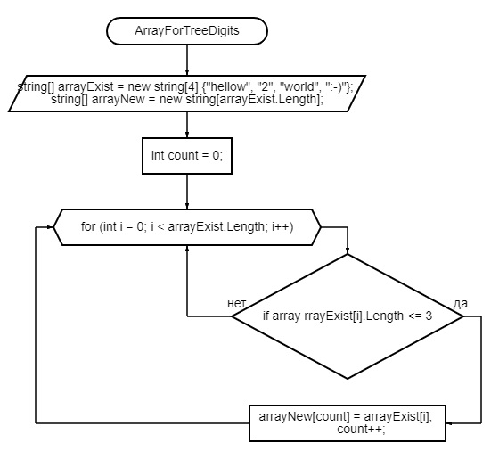

Объявляем 2 массива строк: первый с вводом с клавиатуры и вторый той же длины. Объявляем переменную count для внесения нужного элеманта первого массива во второй. Далее метод FOR, по всей длине массива, в нем проверка условия IF на длину элемента ( <=3 ), если да- элемент первого массива заносится в count элемент второго массива. После присвоения элеманта, переменная count увеличивается на 1. Возвращаемся к циклу for в котором i увеличивается на 1, до конца первого массива.

